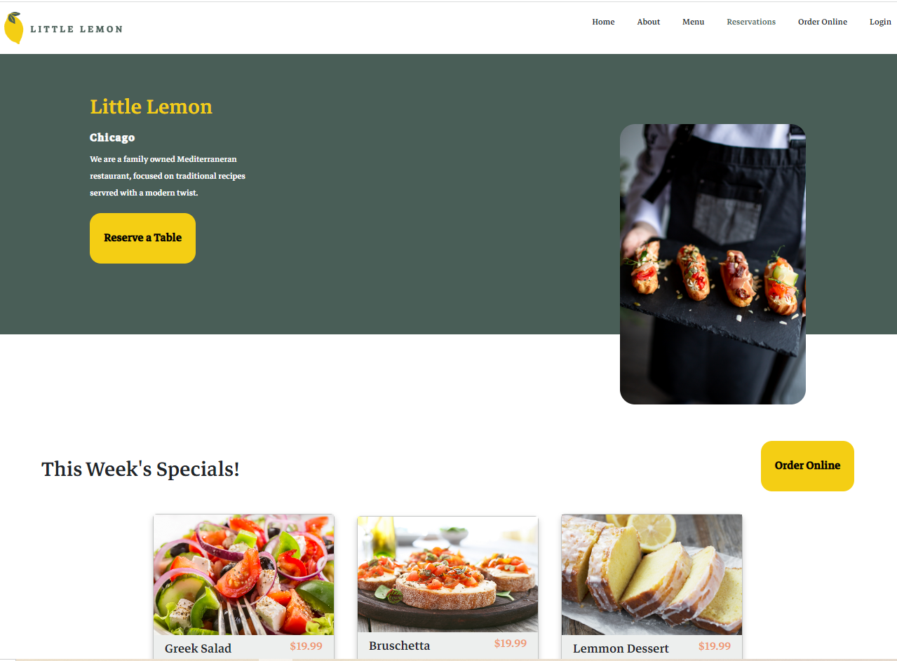

# Little Lemon - Booking Table

This was the final project in my META's Front-End Developer Professional Certificate. The only link and function that works is the table booking button in the header. Styling is based on a style guide.

## Table of contents

- [Overview](#overview)
  - [The challenge](#the-challenge)
  - [Screenshot](#screenshot)
- [My process](#my-process)
  - [Built with](#built-with)
  - [What I learned](#what-i-learned)
  - [Continued development](#continued-development)
  - [Useful resources](#useful-resources)
- [Author](#author)

## Overview

### The challenge

  - All pages will preserve the style guide
  - Have a Reserve-A-Table button on the main page
  - Reservation screen that will include an element to input the date, the time, the number of diners, the occasion, and a button to link to the next screen
  - Reservation form that will include the customer's first and last name, contact information, required fields should be indicated with relevant warnings, a button to confirm or submit the customer information
  - A successful reservation submission confirmation message

### Screenshot



## My process

### Built with

- Semantic HTML5 markup
- CSS custom properties
- REACT

### What I learned

Making this webpage was a quite the challenege due to the amount of material I have to incoroporate, and if I had to summarize the three major takeaways, I'd have to say:
- Bringing together multiple skills from throughout the 7-month course to solve this authentic real-world problem by building an app.
- Requiring me to think differently about building a page and how to go about doing that.
- Working through the issues I had with classmates taught me how to ask better questions to get more specific advice about the problem I had at hand.
- And being the first time took a project from guidelines, to wireframe, to prototype, to production.

Here is some code I am particularly proud of, or think was interesting:

```css
* {
  --primary-1: #495E57;
  --primary-2: #f4ce14;
  --black: #000000;
  --white: #ffffff;
  --secondary-1: #ee9972;
  --secondary-2: #fbdabb;
  --highlight-1: #edefee;
  --highlight-2: #333333;
}
```

### Continued development

This webpage is far from being done yet. Here are some things I'd like to do in the future with it:
  - Fix styling issues
  - Make a functional navigation bar
  - Adding more interactivity
  - and the list goes on

### Useful resources

- [META](https://www.coursera.org/professional-certificates/meta-front-end-developer) - This is where I got the project started from.
- [w3schools](https://www.w3schools.com/) - My reference to remember the syntax and possibilites.

## Author

- Website - [Caius Scipio](https://caius-scipio.github.io/Portfolio/)
